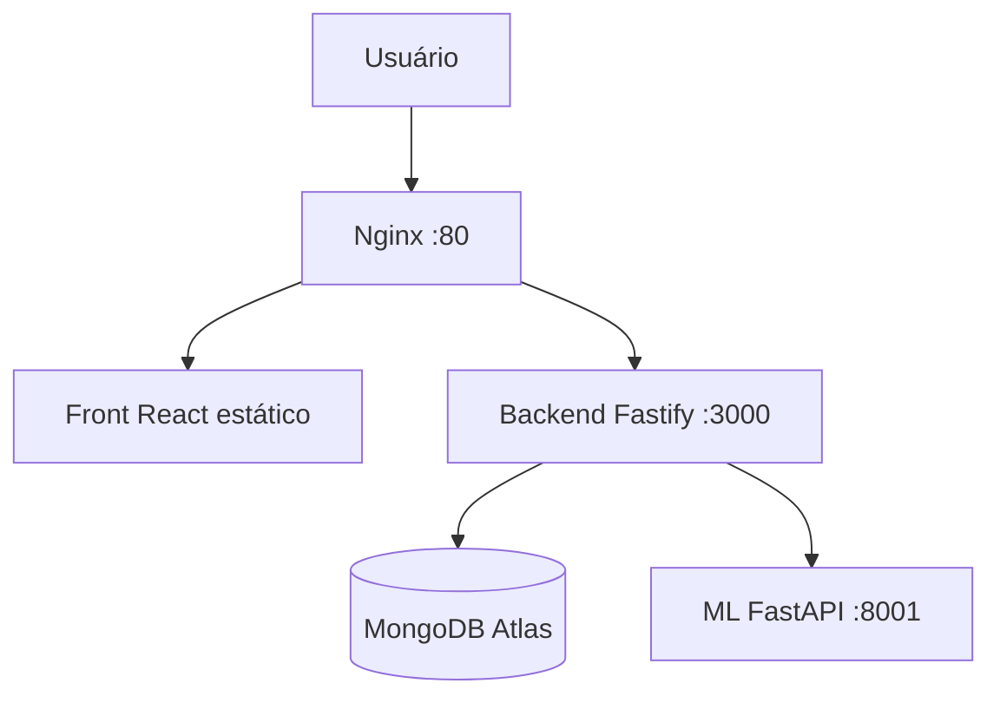
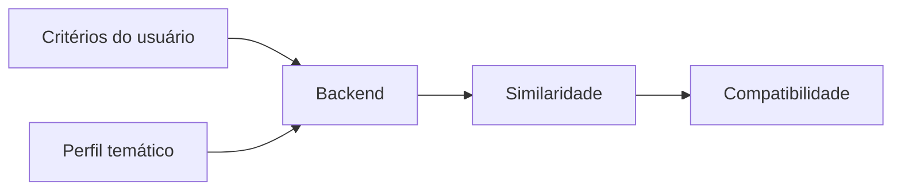
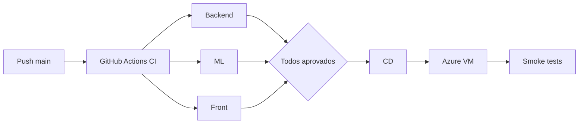

# Projeto Integrador — DSM 5º Semestre

Sistema que reúne e organiza informações públicas oficiais sobre parlamentares federais brasileiros (Câmara dos Deputados e Senado Federal), com classificação temática por machine learning e cálculo de compatibilidade temática a partir de critérios selecionados pelo usuário.

Produção: `http://158.158.48.119/` · API: `http://158.158.48.119/docs`

## Visão geral

O sistema consulta dados públicos oficiais e permite explorar parlamentares, proposições, temas, votações, órgãos/comissões e indicadores de atuação. Há também um fluxo em que o usuário seleciona temas de interesse com prioridades, e o backend calcula a compatibilidade com perfis temáticos derivados dos dados públicos.

Linguagem neutra por princípio: o sistema informa **compatibilidade** e **proximidade temática** segundo os **critérios selecionados** e o **perfil temático** observado nos **dados públicos**. Não indica "melhor" parlamentar, não recomenda voto e não avalia qualidade, ideologia ou honestidade.

## Objetivos

- Centralizar dados legislativos públicos oficiais em uma API única.
- Classificar textos legislativos em temas objetivos com ML auditável.
- Comparar critérios do usuário com perfis temáticos de forma transparente e determinística.
- Entregar portal web, aplicativo mobile e infraestrutura de produção com CI/CD.

## Funcionalidades

| Área | Funcionalidade |
|---|---|
| Parlamentares | Consulta de deputados e senadores, detalhe por ID oficial, busca, paginação |
| Proposições | Lista com filtros (ano, tipo, origem), detalhe, proposições por parlamentar |
| Temas | Catálogo dos 32 temas oficiais da Câmara |
| Indicadores | Estatísticas, votações nominais e participações em órgãos/comissões por período |
| Perfil temático | Distribuição temática da atividade do deputado (modo oficial ou enriquecido) |
| Classificação textual | Classificação experimental de ementas via `POST /api/ml/predict` |
| Compatibilidade | Ranking por similaridade temática com cobertura e evidências |
| Sync administrativo | Importação controlada das APIs oficiais (rotas `/api/sync/*` com Bearer token) |

## Arquitetura



Front e mobile consomem **somente** o backend REST. O front **não** acessa MongoDB, APIs da Câmara/Senado, nem o FastAPI/8001 diretamente. O backend integra as fontes oficiais (sync), persiste no MongoDB e consulta o ML internamente.

## Arquitetura de produção

Azure VM (Ubuntu) com Nginx como única entrada pública na porta **80** (HTTP; sem HTTPS nesta fase):

| Rota pública | Destino |
|---|---|
| `GET /` | Front React estático |
| `/api/*` | Fastify em `127.0.0.1:3000` |
| `/health` | Fastify em `127.0.0.1:3000` |
| `/docs` | Swagger/OpenAPI do Fastify |

Internamente: Fastify em `127.0.0.1:3000`, ML em `127.0.0.1:8001`, MongoDB Atlas. As portas 3000/8001 não são expostas; o Vite dev server (5173) nunca roda em produção.

## Tecnologias

| Camada | Stack |
|---|---|
| Front | React 18, Vite 6, JavaScript/JSX, Vitest, Testing Library, ESLint, Prettier |
| Backend | Node.js 24, TypeScript, Fastify 5, Mongoose, MongoDB Atlas, Vitest, Swagger/OpenAPI, Zod |
| ML | Python 3.12, FastAPI, scikit-learn (TF-IDF + LinearSVC), Pydantic, pytest |
| Mobile | Expo, React Native, TypeScript, expo-router |
| Infra | Azure VM (Ubuntu), Nginx, systemd, GitHub Actions |

Sem Docker: o projeto não utiliza containers.

## Estrutura do repositório

```text
.
├── backend/     # API Fastify (único ponto de acesso dos clientes)
├── front/       # Portal web React + Vite
├── ml/          # Serviço FastAPI de classificação temática
├── mobile/      # Aplicativo Expo/React Native
├── infra/       # Nginx, systemd, scripts de deploy, docs de infra
├── .github/     # Workflows de CI e CD
└── README.md
```

## Fontes dos dados

Dados exclusivamente públicos e oficiais, integrados/sincronizados pelo backend (front e mobile nunca acessam essas fontes diretamente):

- Câmara dos Deputados — API de Dados Abertos (`https://dadosabertos.camara.leg.br/api/v2`, [swagger](https://dadosabertos.camara.leg.br/swagger/api.html))
- Senado Federal — API de Dados Abertos (`https://legis.senado.leg.br/dadosabertos`)

## Backend/API

Node.js + TypeScript + Fastify, API REST/JSON, MongoDB via Mongoose, Swagger/OpenAPI, organizado em módulos (rotas, serviços, repositórios, integrações). Integrações com Câmara/Senado via clients dedicados com validação Zod; integração com o ML via HTTP interno com timeout e mapeamento de falhas (503/504/502).

Collections MongoDB: `parlamentares` (deputados e senadores, índice `source + externalId`), `proposicoes` (proposições e matérias), `votacoes`, `votos`, `participacoes_orgaos`, `sync_logs` e `parliamentarian_theme_profiles` (perfis materializados por deputado/período/modo).

### Principais grupos da API

| Grupo | Exemplos |
|---|---|
| Saúde | `GET /health` (status da API + MongoDB), `GET /` (JSON raiz, interno) |
| Parlamentares | `GET /api/parlamentares/deputados`, `GET /api/parlamentares/senadores`, `.../:id`, `.../:id/proposicoes` |
| Proposições | `GET /api/proposicoes` (filtros `source`, `ano`, `tipo`), `GET /api/proposicoes/:id` |
| Indicadores | `.../:id/estatisticas`, `.../:id/votacoes`, `.../:id/orgaos` |
| Temas | `GET /api/temas?source=CAMARA` (32 temas oficiais) |
| Perfil temático | `GET /api/parlamentares/deputados/:id/perfil-tematico` |
| ML | `GET /api/ml/health`, `POST /api/ml/predict` |
| Compatibilidade | `POST /api/compatibilidade` |
| Sync (admin) | `POST /api/sync/*` (Bearer token, fora do fluxo dos clientes) |

Documentação completa (OpenAPI/Swagger): `http://158.158.48.119/docs` (`/docs/json` para o contrato em JSON).

## Machine Learning

O ML **não** escolhe parlamentar e **não** recomenda voto: classifica textos/proposições em temas objetivos.

```text
Texto/ementa → limpeza conservadora → TF-IDF (1-2 gramas) → LinearSVC → temas
```

- Modelo servido: `linear_svc_balanced` (`class_weight=balanced`), versão `experimental-1`.
- 32 temas oficiais da Câmara, classificação **multi-label** (zero a N rótulos por texto).
- `POST /predict` recebe `{"text": "..."}` (até 5.000 caracteres) e retorna `labels` com `code`, `name` e `decisionScore`.
- `decisionScore` é a **margem de decisão** do classificador: **não** é probabilidade, confiança ou percentual.

<details>
<summary>Dataset e treinamento (resumo dos relatórios em <code>ml/reports/</code>)</summary>

- Janela 2023–2025, dados oficiais: 246.824 documentos (Câmara 231.549, Senado 15.275); 44.541 documentos Câmara candidatos ao treino.
- Split anti-leakage por grupo (hash da ementa normalizada), seed 42, alvo 70/15/15: treino 31.179, validação 6.681, teste 6.681 documentos, interseções zeradas.
- TF-IDF com 70.096 features (ajustado só no treino); classes raras presentes (ex.: 8 e 17 documentos).
- Vencedor `linear_svc_balanced` — teste: F1 micro 0,756, macro 0,668 (validação: micro 0,755, macro 0,665).
- Testes: `python -m pytest -q` e `python -m unittest discover -s tests -v` (13 arquivos, fixtures locais, sem internet).

</details>

## Compatibilidade

Compatibilidade **não** é produzida pelo classificador: o backend compara critérios do usuário com perfis temáticos materializados usando **similaridade de cosseno**.



`POST /api/compatibilidade` recebe `source: "CAMARA"`, período, `themeSource`, 1–10 temas com peso 1–5 e `limit` (padrão 5). Retorna ranking com `compatibility`/`compatibilityPercent`, cobertura, `matchedThemes` e evidências (proposições, com origem `OFFICIAL` ou `ML`). Desempate determinístico: compatibilidade, cobertura, ID oficial. Preferências não são persistidas; escopo sem perfis prontos retorna 503.

O resultado **não** representa qualidade, ideologia, concordância em votações, recomendação de voto ou previsão eleitoral — apenas similaridade temática segundo os critérios informados.

## Front-End Web

React + Vite com rotas por hash (`#/inicio`, `#/proposicoes`, `#/representantes`, `#/temas`, `#/afinidade`): Dashboard, Proposições (lista + filtros + classificação experimental), Representantes (deputados/senadores + perfil completo em modal), Temas (catálogo) e Afinidade (compatibilidade).

Chamadas com URLs relativas (`/api/...`, `/health`): em produção, same-origin via Nginx. Em desenvolvimento, proxy Vite para `VITE_PROXY_TARGET` (fallback: `http://158.158.48.119`); backend local opcional com `VITE_PROXY_TARGET=http://127.0.0.1:3000`. `.env.example` é só documentação, não configuração automática.

## Mobile

Aplicativo Expo/React Native com TypeScript e 5 abas (Início, Propostas, Representantes, Temas, Afinidade), perfil do representante por rota, busca, filtros e paginação. Consome somente o backend REST (`EXPO_PUBLIC_API_URL`; padrão da plataforma). Estado: em desenvolvimento, com telas ligadas à API e testes com mocks.

## Executando localmente

### Front

```bash
cd front
npm ci
npm run dev
```

Abre em `http://127.0.0.1:5173` usando o proxy para a API (Azure por padrão; `VITE_PROXY_TARGET` para backend local).

### Backend

```bash
cd backend
npm ci
cp .env.example .env   # preencher MONGODB_URI (obrigatória) e demais valores
npm run dev
```

Sobe em `http://127.0.0.1:3000` (`npm run build` + `npm start` para a versão compilada). Rotas `/api/ml/*` exigem o FastAPI no ar; variáveis em `backend/.env.example` (`ML_SERVICE_URL` padrão `http://127.0.0.1:8001`).

### ML

```bash
cd ml
python -m pip install -r requirements.txt
uvicorn src.api.app:app --host 127.0.0.1 --port 8001
```

Requer Python 3.12+.

### Mobile

```bash
cd mobile
npm install
npm start   # android / ios / web conforme README do app
```

## Testes

| Componente | Validação |
|---|---|
| Front | `lint`, `format:check`, `test` (11 arquivos, 36 testes), `test:coverage` (77,5% stmts), `build`, `npm audit` |
| Backend | `lint`, `format:check`, `test` (52 arquivos, 418 testes), `test:coverage` (90,7% stmts), `build` (HTTP via `Fastify.inject`, sem portas/Atlas) |
| ML | `compileall`, `pytest`, `unittest` (13 arquivos de teste) |

## CI/CD



CI (`.github/workflows/ci.yml`) valida os três componentes; CD (`.github/workflows/cd.yml`) só roda após CI verde em push na `main`, via SSH restrita (`deploy <SHA>`, chave `DEPLOY_SSH_PRIVATE_KEY`), implantando o SHA aprovado. O front é buildado deterministicamente na VM (`npm ci` + `npm run build`).

## Deploy / Azure

Produção: `http://158.158.48.119/` · Swagger: `http://158.158.48.119/docs` · Health: `http://158.158.48.119/health` (HTTP; sem HTTPS nesta fase).

Deploy do front por releases: `front/dist/` → `/var/www/dsm-p5-g02/releases/<sha>/`, symlink atômico `current` (raiz do Nginx), retenção das 5 mais recentes (a atual nunca é removida), arquivos `root:www-data`. O `deploy.sh` verifica a release (`/` em `text/html` com o app, assets reais, `/health` conectado) e aborta em qualquer falha; `nginx -t` antes de todo reload.

<details>
<summary>Backup, rollback e lição aprendida do deploy</summary>

- Backup timestamped em `/var/backups/dsm-p5-g02/<ts>/` (config Nginx ativa, dump `nginx -T`, `nginx -t`, units systemd, `SHA256SUMS`); backups anteriores preservados.
- Rollback do front: apontar `current` para a release anterior + `nginx -t` + reload. Rollback do Nginx: restaurar a config do backup + `nginx -t` + reload.
- Lição: na estreia do front, o `deploy.sh` atualizado após o checkout não assumiu o processo em execução (o shell seguia na versão antiga aberta), e o front não foi publicado. Correção: o script reexecuta a própria versão atualizada após o checkout, protegido por `DSM_DEPLOY_REEXECED`.

</details>

## Segurança

- Nginx como única entrada pública; backend e ML só em loopback; Vite nunca em produção.
- MongoDB acessível só pelo backend; sync administrativo exige `Authorization: Bearer <SYNC_API_TOKEN>`.
- Segredos fora do Git (`.env` ignorado, `/etc/dsm-p5-g02/backend.env` só na VM, GitHub Secrets para deploy); SSH de deploy restrita a um único comando.
- CORS por allow-list (mesma origem em produção dispensa CORS); rate limit global + limites menores em predict/compatibilidade/sync; `TRUSTED_PROXY_ADDRESSES` só loopback.
- Menor privilégio: releases `root:www-data`, sem `chmod 777`, sem `NOPASSWD` novo.

## Problemas comuns

<details>
<summary><code>ECONNREFUSED 127.0.0.1:3000</code> no <code>npm run dev</code></summary>

O proxy Vite mira o backend local, que não está rodando. Suba o backend em `127.0.0.1:3000` ou aponte `VITE_PROXY_TARGET` para a API Azure.

</details>

<details>
<summary><code>/health</code> falha</summary>

Backend fora do ar ou MongoDB desconectado (`status: "degraded"`, `database: "disconnected"` indica o segundo caso). Checar serviço e conectividade.

</details>

<details>
<summary><code>/api/ml/health</code> falha</summary>

Serviço FastAPI fora do ar (`dsm-ml.service`, `127.0.0.1:8001`). O backend segue saudável sem o ML.

</details>

<details>
<summary>Front 404 / assets 404 em produção</summary>

Conferir `ls -la /var/www/dsm-p5-g02/`, alvo do symlink `current` e se os hashes em `/assets/*` conferem com o `index.html` implantado; depois `nginx -t` e reload.

</details>

## Estado atual

| Componente | Estado |
|---|---|
| Backend | Implementado |
| ML | Implementado |
| Front Web | Implementado |
| Mobile | Em desenvolvimento |
| Banco | Integrado (MongoDB Atlas) |
| Azure | Implantado (HTTP :80) |
| CI | Ativo (Backend + ML + Front) |
| CD | Ativo (SHA aprovado → VM) |

## Equipe

- Leonardo Sudario — front-end, backend, infraestrutura e CI/CD.
- Roberta Barcarollo — machine learning.

Projeto acadêmico (FATEC DSM 5º semestre) de interesse público, sem vínculo partidário; dados da Câmara dos Deputados e do Senado Federal.
